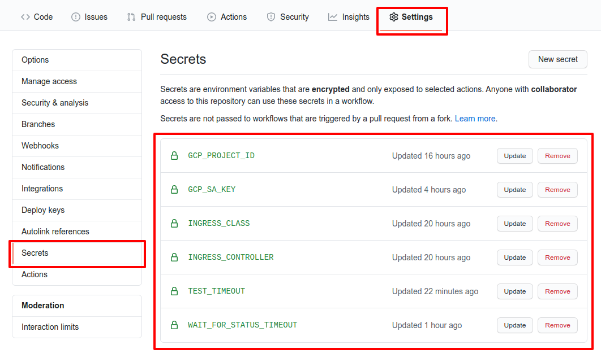

# ingress-conformance-sample-kubeconfig

Sample repository to show how to run the conformance suite and generate reports using github pages.

### Website - https://aledbf.github.io/ingress-conformance-sample-kubeconfig/

### Github action jobs:

- *Prepare environment* downloads [sonobuoy](https://github.com/vmware-tanzu/sonobuoy) binary
- *Run conformance tests* using `sonobuoy run` and waits until finishes
- *Generate reports* extracts cucumber json files from `sonobuoy retrieve` output and generates static html files

### How I run the conformance test using a particular ingress controller?

- Fork the repository -> **Click Settings** -> **Click Secrets**
- Change secret `KUBE_CONFIG` value

where:

- **INGRESS_CLASS:** name of the class that are valid for the ingress controller
- **KUBE_CONFIG:** holds a kubeconfig file content
- **INGRESS_CONTROLLER:** name of the ingress controller (default `N/A`)
- **CONTROLLER_VERSION:** version of the ingress controller (default `N/A`)
